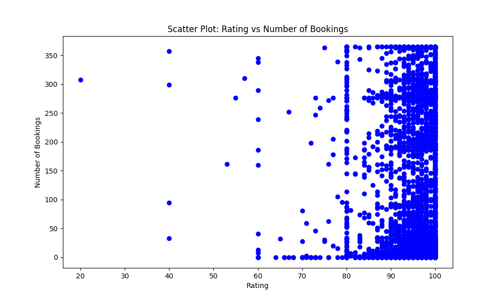

The project analyzes the Airbnb activities in Seattle dataset based on following datasets:

- **Listings**, including full descriptions and average review score
- **Reviews**, including unique id for each reviewer and detailed comments
- **Calendar**, including listing id and the price and availability for that day

These data can be downloaded from https://www.kaggle.com/datasets/airbnb/seattle/data

The purpose of that project is to analyse thee topics:

1. How do prices influence amount of bookings?
2. In which areas are the most accomodations located? (neighbourhood)
3. Which accomodations have the best review scores and how do they go together with bookings?

# 1. How do prices influence amount of bookings?

The first step of the project helps to understand the customer group and to find out in which apartments customers are most interested. What attracts them the most: the cheaper prices or the quality of the apartments (even though the prices might be a bit higher)?

It has been found that the most attractive apartments cost between $50 and $200 and do not belong to the exclusive group of apartments. They are not at the cheapest level but rather belong to the lower price range. This means that people paying for $50-$200 apartments are the main group of customers.

Starting at $200 and upwards, the number of bookings decreases with each price increase and becomes very rare for the most expensive ones.

It was interesting to realize that the cheapest accommodations (up to $50) are also frequently used, though not as often as those in the main customer group.

# 2. In which areas are the most accomodations located? (neighbourhood)

For people who are traveling, it might be of interest to know where the most accommodations are located.

This might be an indicator of the most attractive neighborhoods. On the other hand, it might be easier to find a place to stay in an area with a high number of accommodation options.

It has been realized that the most accommodations are in Capitol Hill (21.3%), followed by Ballard (12.9%), Belltown (12.4%), Minor (11.6%), and Queen Anne (11.3%).

The proportion of remaining neighborhoods (Fircrest, Wallingford, University District, and First Hill) is below 10% and does not provide as many options as the others.

# 3. Which accomodations have the best review scores and how do they go together with bookings?

Another question we were interested in was whether the review scores of the accommodations influence the number of their bookings.

And indeed, as expected, the higher the ratings of the accommodations, the higher the number of their bookings.

This emphasizes the critical role of customer satisfaction and the value of their feedback in influencing future bookings and overall success.

